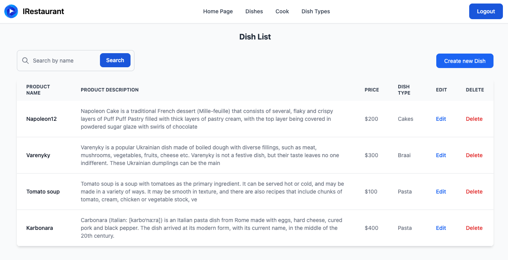

# Restaurant Service

Django project for management cook, dish, and dish type of Restaurant Service

## Demo image



## If you want to try locally

Download project
```shell
git clone https://github.com/LavrykN/restaurant_kitchen_service.git
```

Create and activate venv environment
```shell
python3 -m venv venv
source venv/bin/activate (on Linux) or venv\Scripts\activate (on Windows)
```

Install requirements
```shell
pip install -r requirements.txt
```

Migrate migrations
```shell
python manage.py migrate
```

Create user
```shell
python manage.py createsuperuser 
```

Run server
```shell
python manage.py runserver
```

## Functionality

* Authentication for Cook/User
* Managing cook, dish, and dish type using CRUD operations from the website


